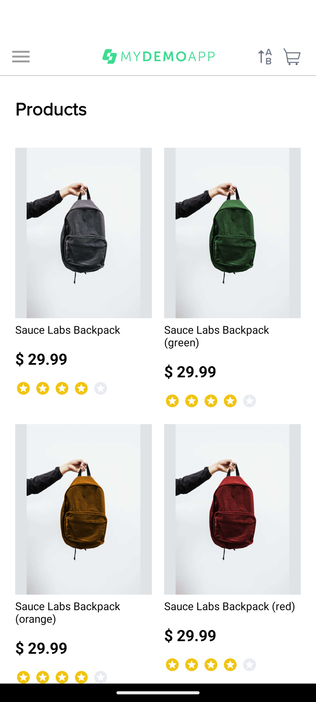
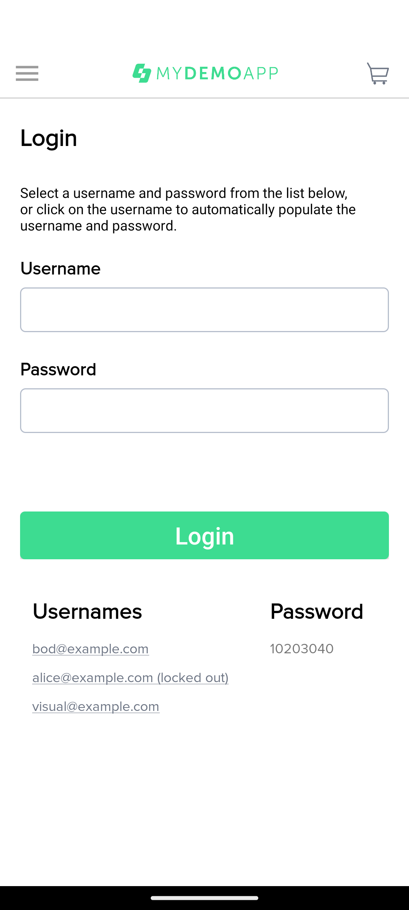
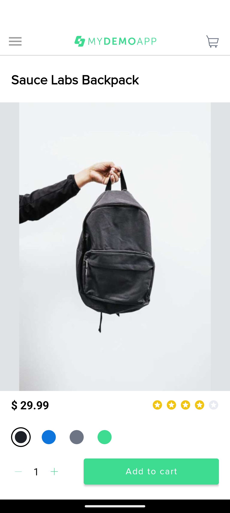
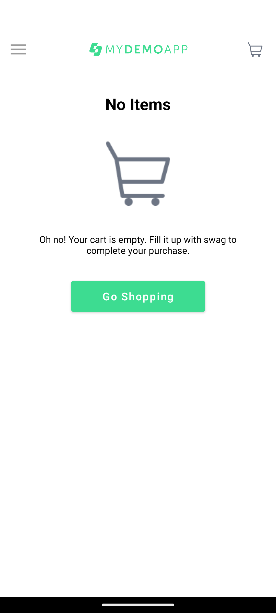
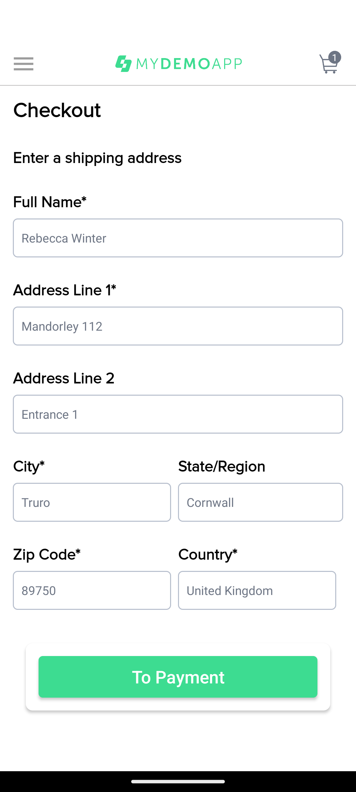
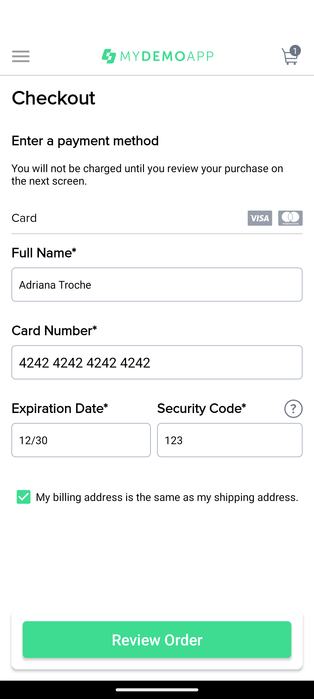
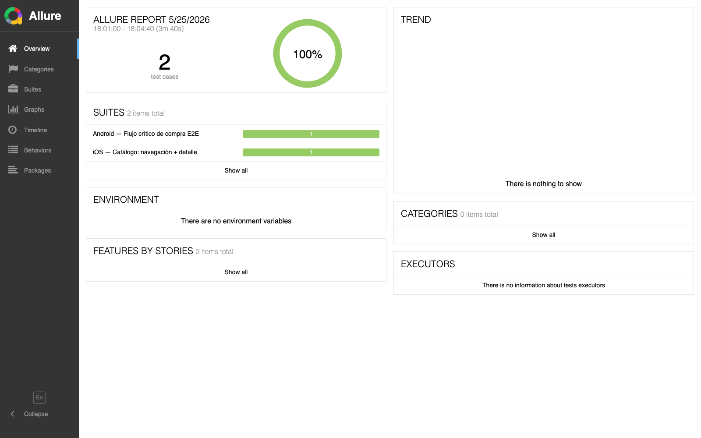
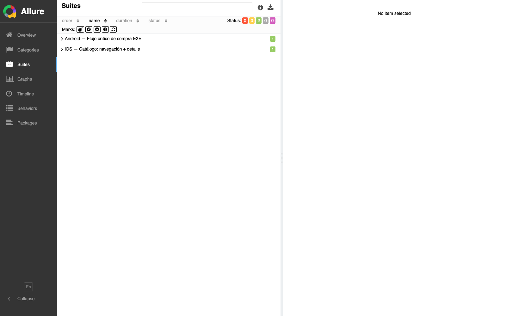
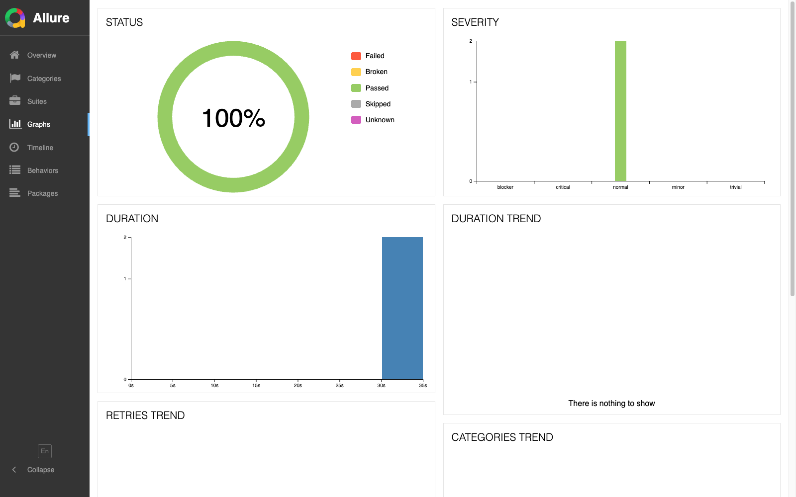
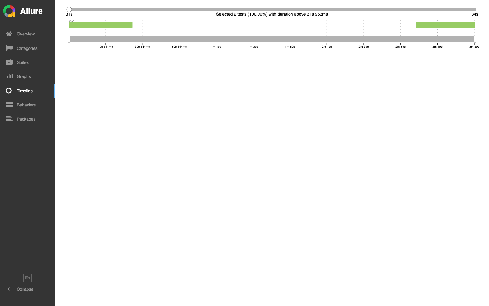

# 📊 Evidencias de Ejecución — Reto 3 Mobile Automation

Documento de entrega con evidencias completas de la ejecución de la suite de automatización mobile cross-platform.

**Autora**: Adriana Troche
**Fecha**: 2026-05-25
**Repositorio**: https://github.com/adrianagit87/reto3-mobile-automation

---

## 1. Resumen ejecutivo

| Métrica | Valor |
|---|---|
| Plataformas cubiertas | Android (local) + iOS (SauceLabs cloud) |
| Tests E2E implementados | 2 (1 por plataforma) |
| Tests pasando | **2 de 2 (100%)** ✅ |
| Page Objects implementados | 9 (7 Android + 2 iOS) |
| Cobertura Android | Login + Catálogo + Detalle + Carrito + Checkout completo (E2E con pago) |
| Cobertura iOS | Tabs + Catálogo + Detalle + Gestos swipe + Rating |
| Tiempo total Android | **34.6 segundos** |
| Tiempo total iOS | **42.2 segundos** |
| Framework | WebdriverIO v9 + Appium 2 + TypeScript + Mocha |
| Patrón | Page Object Model (POM) con BasePage abstracta |

---

## 2. Ejecución Android (local)

### 2.1 Comando ejecutado
```bash
npm run test:android
```

### 2.2 Configuración usada
- **Emulador**: `Maestro_ANDROID_pixel_6_android-33` (Pixel 6, API 33 / Android 13)
- **Arquitectura**: ARM64 (nativa en Mac M-chip — alta performance)
- **APK**: `mda-2.2.0-25.apk` (My Demo App v2.2.0, 17 MB)
- **Driver**: UiAutomator2 v3.10.0
- **Appium**: 2.19.0 (local en proyecto)

### 2.3 Resultado
```
✓ debe completar el flujo de compra con un usuario válido
1 passing (34.6s)
Spec Files:  1 passed, 1 total (100% completed) in 00:00:44
```

### 2.4 Flujo cubierto (11 pasos)

| # | Paso | Página/Componente | Resultado |
|---|---|---|---|
| 1 | App abierta — catálogo cargado | CatalogPage | ✅ |
| 2 | Abrir menú lateral | CatalogPage.openMenu() | ✅ |
| 3 | Tap "Log In" | MenuPage.goToLogin() | ✅ |
| 4 | Login con `bod@example.com` / `10203040` | LoginPage.login() | ✅ |
| 5 | Selección de "Sauce Labs Backpack" | CatalogPage.selectProduct() | ✅ |
| 6 | Validar título + precio | ProductDetailPage | ✅ |
| 7 | Add to Cart | ProductDetailPage.addToCart() | ✅ |
| 8 | Ver carrito, validar 1 item | CartPage.getItemCount() === 1 | ✅ |
| 9 | Proceed to Checkout + llenar shipping | CheckoutPage.fillShipping() | ✅ |
| 10 | Llenar payment + tap Review Order | CheckoutPage.fillPayment() | ✅ |
| 11 | Place Order + validar "Checkout Complete" | CheckoutCompletePage | ✅ |

### 2.5 Capturas Android

#### Emulador listo (API 33)


#### Pantalla de Login


#### Catálogo (post-login)


#### Detalle del producto


#### Carrito con item


#### Formulario de envío (Shipping)


#### Formulario de pago (Payment) — datos llenados por el test


---

## 3. Ejecución iOS (SauceLabs cloud)

### 3.1 Comando ejecutado
```bash
npm run test:ios
```

### 3.2 Configuración usada
- **Cloud**: SauceLabs Real Device Cloud (free trial, región us-west-1)
- **Device**: iPhone Simulator (asignación automática por SauceLabs)
- **Platform**: iOS 17
- **App**: `SauceLabs-Demo-App.Simulator.zip` (v2.2.2, 4.7 MB, subida a Sauce Storage)
- **Driver**: XCUITest

### 3.3 Resultado
```
✓ debe abrir el catálogo, listar productos y validar el detalle del primero
1 passing (42.2s)
Spec Files:  1 passed, 1 total (100% completed) in 00:03:18
```

### 3.4 Flujo cubierto (7 pasos)

| # | Paso | Página/Componente | Resultado |
|---|---|---|---|
| 1 | Navegar Cart tab → Catalog tab | CatalogPage.openCatalogTab() | ✅ |
| 2 | Validar productos visibles (6 productos) | CatalogPage.getVisibleProductCount() | ✅ |
| 3 | Obtener nombre del primer producto | CatalogPage.getFirstProductName() | ✅ |
| 4 | Tap en primer producto | CatalogPage.selectFirstProduct() | ✅ |
| 5 | Validar precio + descripción + Add to Cart visible | ProductDetailPage | ✅ |
| 6 | Swipe horizontal en galería | ProductDetailPage.swipeImageGallery() (W3C Actions) | ✅ |
| 7 | Calificar con 5 estrellas | ProductDetailPage.giveFiveStarRating() | ✅ |

### 3.5 Acceso al run en SauceLabs

🔗 **URL pública del run**: https://app.saucelabs.com/tests/22c50ba591f74ca4bb89c368f35e2e7c

En el dashboard de SauceLabs encontrarás:
- 🎥 **Video completo en MP4** de la ejecución
- 📸 Screenshots automáticos por step
- 📋 Logs completos de Appium server
- 🌐 Network logs y device metrics

---

## 4. Reporte Allure

### 4.1 Generación
```bash
npm run clean          # IMPORTANTE: limpiar resultados acumulados
npm run test:android
npm run test:ios
npm run report
```

### 4.2 Capturas del dashboard

#### Overview — 100% pass rate, 2 test cases


#### Suites — Android E2E + iOS Catálogo, ambos en verde


#### Graphs — Status 100% PASSED, distribución de duración


#### Timeline — Ejecución paralela visualizada


### 4.3 Métricas del run limpio

| Métrica | Valor |
|---|---|
| Test cases | 2 |
| Tests PASSED | 2 |
| Tests FAILED | 0 |
| Pass rate | **100%** |
| Categories (defects) | 0 |
| Severity | normal × 2 |
| Duración total | 3m 40s (incluye provisioning SauceLabs iOS) |

### 4.4 Características del reporte
- Vista por suite, por feature, por categoría
- Timeline de tests con duración individual
- Attachments automáticos (screenshots de fallos, page sources)
- Trends entre runs (suite health, retries, duration)

### 4.5 ⚠️ Lección aprendida — Allure es acumulativo
Los resultados de Allure NO se limpian automáticamente entre runs. Si tenés resultados viejos en `allure-results/` (de runs fallados o con tests renombrados), el reporte va a mostrarlos como "Test defects" aunque ya estén arreglados.

**Regla de oro**: `npm run clean` antes de regenerar el reporte para entrega oficial.

---

## 5. Pipeline Jenkins

### 5.1 Stages definidos en `Jenkinsfile`
1. **Checkout** del código del repositorio
2. **Install dependencies** (`npm ci`)
3. **TypeScript check** (`tsc --noEmit`)
4. **Test Android** (levanta emulador, corre `test:android`)
5. **Test iOS** (corre `test:ios` contra SauceLabs)
6. **Generate Allure Report**
7. **Archive artifacts** (reporte, screenshots, logs)

### 5.2 Credenciales necesarias en Jenkins
- `sauce-username` (Secret text)
- `sauce-access-key` (Secret text)

### 5.3 Parámetros del build
- `RUN_ANDROID` (default `true`)
- `RUN_IOS` (default `true`)

---

## 6. Repositorio

🐙 **URL**: https://github.com/adrianagit87/reto3-mobile-automation

### Estructura del proyecto (25 archivos código + docs)
```
reto3-mobile-automation/
├── README.md              ← Doc principal con escenarios y viabilidad
├── EVIDENCIAS.md          ← Este documento
├── Jenkinsfile            ← Pipeline declarativo
├── env.example            ← Plantilla de variables (NO secrets)
├── package.json
├── tsconfig.json
├── apps/                  ← APKs/IPAs (gitignored)
├── config/                ← 3 configs WDIO (shared, Android, iOS)
├── src/
│   ├── pages/
│   │   ├── BasePage.ts    ← Clase abstracta del POM
│   │   ├── android/       ← 7 POs Android (UiAutomator2)
│   │   └── ios/           ← 2 POs iOS (XCUITest)
│   └── helpers/
│       └── gestures.ts    ← W3C Actions: swipe cross-platform
├── test/specs/
│   ├── android/purchase-flow.e2e.ts
│   └── ios/catalog-navigation.e2e.ts
└── docs/evidencias/       ← Capturas para entrega
```

---

## 7. Aprendizajes técnicos relevantes

### 7.1 Discovery de locators reales
Los locators iniciales fueron adivinanzas educadas. Hubo que **dumpear la UI** real de cada pantalla con:
```bash
# Android
adb shell uiautomator dump
adb pull /sdcard/window_dump.xml

# iOS (vía WDIO test)
await browser.getPageSource()
```

### 7.2 Diferencias Android vs iOS
| Aspecto | Android UiAutomator2 | iOS XCUITest |
|---|---|---|
| Selector por accesibilidad | `content-desc` (`~content`) | `accessibilityIdentifier` (`~name`) |
| Selector por ID | resource-id vía UiSelector | predicate string o class chain |
| Combinación de criterios | UiSelector chainable | predicate string con `AND`/`OR` |
| Elementos no accesibles | `clickable="false"` (tappable check) | `accessible="false"` (selector hidden) |

### 7.3 Gotchas resueltos
- **Android 16 (API 36) 16KB-page-size warning**: tapa la app en cada launch → usar API 33-35 en Mac M-chip
- **WDIO v9 specs paths**: relativos al config file, no al cwd → `../test/specs/...` desde `config/`
- **iOS app abre en Cart tab**: no Catalog. Hay que tapear `~Catalog-tab-item`
- **iOS ProductItem `accessible="false"`**: no se alcanza por `~`. Usamos el primer `~Product Image` que sí es accesible
- **SauceLabs simulator vs device routing**: `deviceName: 'iPhone 15'` enruta a Real Device. Para sim usar `'iPhone Simulator'`
- **SauceLabs free trial**: 1 sesión concurrente. Sesiones colgadas hay que matarlas via REST API: `PUT /jobs/{id}/stop`

### 7.4 Patrón POM aplicado
- **BasePage abstracta** con `waitForLoaded`, `tap`, `setValue`, `readText`
- Cada PO declara su `loadedIndicator` (selector que confirma carga)
- **POs separados por plataforma** (locators son distintos)
- **Tests usan SÓLO POs** — no aparece un `$()` en specs

---

## 8. Conclusiones

✅ Ambos escenarios automatizados pasaron los **6 criterios de viabilidad** documentados en el README.

✅ La arquitectura POM permitió ajustar locators sin tocar tests: cambiar **1 línea en 1 PO** corrige todo el flujo.

✅ Separar Android (local) e iOS (cloud) demuestra integración con servicios externos sin requerir Xcode local.

✅ El Jenkinsfile habilita ejecución continua con parámetros para flexibilidad en CI.

✅ El reporte Allure y las capturas automáticas en fallo proveen evidencia visual exhaustiva.

---

## 9. Próximos pasos (mejoras futuras)

- Sumar tests negativos (login con credenciales inválidas, validación de campos vacíos)
- Sumar matriz de devices en SauceLabs (varios iOS + Android)
- Sumar tests de regresión visual con `@wdio/visual-service`
- Integrar BrowserStack como alternativa al cloud
- Sumar tests de accesibilidad (axe-core)
- Generar reportes cruzados con criterios de aceptación (traceability matrix)
